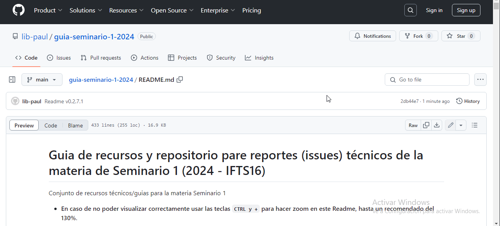

# Guia de recursos y repositorio para reportes (issues) técnicos de la materia Seminario 1 (2024 - IFTS16)
Conjunto de recursos técnicos/guias para la materia Seminario 1 

* <strong>En caso de no poder visualizar correctamente usar las teclas `CTRL y +` para hacer zoom en este Readme, hasta un recomendado del 130%</strong>.

* Si al panel de la izquierda no permite visualizar correctamente procedemos a cerrarlo de la siguiente forma:


* A la derecha del documento se encuentra el índice automático y si se encuentran en alguna sección debajo de la navegación principal cuentan con un botón para volver al inicio, de la siguiente forma:




# Indice

- [1 - Introducción a Django](#1-introducción-a-django)
- [2 - Creando nuestro proyecto](#2-creando-nuestro-proyecto)
- [3 - Creando nuestra primera aplicación](#3-creando-nuestra-primera-aplicación)
- [4 - Creando nuestra primera vista](#4-creando-nuestra-primera-vista)
- [5 - Creando nuestro primer modelo](#5-creando-nuestro-primer-modelo)
- [6 - Interactuando con el modelo](#6-interactuando-con-la-base-de-datos)
- [X.1 - ¿Cómo hago puedo utilizar este repositorio para pedir ayuda o dejar comentarios?](#x1-issues-o-reportes)
- [X.2 - Recursos externos](#x2-recursos-externos)


# 1. Introducción a Django:

Django es un framework de desarrollo web para Python, que nos permite crear aplicaciones web de manera rápida y sencilla. Entonces, ¿qué necesitamos para empezar a 
desarrollar nuestra aplicación web?

## 1.1 Instalación de requerimientos

Primero y principal necesitamos contar con Python, para ello podemos descargar el instalador desde [python.org](https://www.python.org/downloads/) y un IDE para poder 
escribir nuestro código, recomendado [VSCode](https://code.visualstudio.com/download). 
Al momento de la instalación, asegurarse de agregar Python al PATH con la opción que trae el instalador en caso de que se instale en Windows. 


Como recomendación, el Visual Studio Code nos permite instalar extensiones que nos ayudan a desarrollar mas rapido, algunas de ellas son:

- Python (El conjunto que trae por defecto la extensión)
- Django
- SQLite Viewer (Por ahora utilizaremos esta base de datos, en un futuro podremos usar otras como PostgreSQL,MySQL, etc.)


<br>

# 2. Creando nuestro proyecto:

## 2.1 Preparando nuestro entorno virtual

1. Abrimos VSCode y buscamos la opción de "Abrir Carpeta" en el menu de la izquierda. 

2. Seleccionamos la carpeta donde queremos crear nuestro proyecto (en caso de no tener una carpeta en especifico, podemos crear una nueva carpeta y nombrarla como 
queramos).

De esta forma:


3. Si nos pide confirmación sobre los permisos para utilizar la carpeta, seleccionamos que confiamos en los autores de la carpeta.


4. Luego como Windows puede no permitirnos activar nuestro entorno virtual, en la terminal que se abre por defecto(powershell), procedemos a lo siguiente:

- Apretamos el boton "F1" para abrir la paleta de comandos.
- Escribimos "default terminal" y seleccionamos la opción que dice "Select Default Profile".


- Seleccionamos "Command Prompt" y listo.


5. Procedemos a abrir una terminal usando el menu de la izquierda donde dice "Terminal" y luego "Nueva Terminal".


6. Verificamos que Python se encuentra instalado ejecutando el comando `python --version` y nos debe mostrar la versión que tenemos instalada.


7. Como no utilizaremos "venv" puesto a que cuenta con algunas desventajas, procedemos a instalar virtualenv.

- Ejecutamos el siguiente comando desde la terminal cmd `pip install virtualenv`.


8. Ahora procedemos a crear nuestro entorno virtual.

- Ejecutamos el comando en la terminal `virtualenv venv` este comando crea una carpeta llamada "venv" en la carpeta de nuestro proyecto que vamos a utilizar para 
instalar las dependencias de nuestro proyecto.

9. Por ultimo, activamos nuestro entorno virtual.

- En Windows ejecutamos el comando `venv\Scripts\activate`.

10. Nuestro entorno virtual se encuentra activo cuando en la terminal nos muestra el nombre de nuestro entorno virtual seguido de "(venv)".


## 2.2 Creando nuestro proyecto

1. Lo siguiente es instalar Django en nuestro entorno virtual, para ello ejecutamos el comando desde la terminal:
```
pip install django
``` 
Para comprobar que se ha instalado correctamente ejecutamos el comando:

```
django-admin --version
```

2. Procedemos a crear nuestro proyecto, para ello ejecutamos el comando :

```
django-admin startproject nombre_del_proyecto
```

 el nombre es indistinto en tanto no utilice algun nombre que el framework ya utilice, por ejemplo "django". Nos tiene que quedar un directorio parecido al siguiente:


3. Pero como no queremos que el directorio del proyecto tenga un "nivel" extra de carpeta, borramos el directorio creado y al comando anterior le añadimos un "." de 
la siguiente forma 

```
django-admin startproject nombre_del_proyecto .
```

Nos tiene que quedar de esta forma:


3. Ahora procedemos a ejecutar nuestro proyecto con el comando `python manage.py runserver` en la terminal y nos debe mostrar un mensaje que nuestro servidor se 
esta ejecutando, esto nos indica que nuestro proyecto inicia correctamente.


4. Si todo sale bien, procedemos a abrir nuestro navegador y escribir la siguiente direccion `http://127.0.0.1:8000/` y nos debe mostrar la pagina de inicio de django.


# 3. Creando nuestra primera aplicación:

## 3.1 Creando nuestra primera aplicación:

Que es una aplicación en Django?

En Django una "app" es una pequeña parte del proyecto, separado de la aplicación principal esto permite modularizar la aplicación para luego permitir la 
escalabilidad. Como por ejemplo, tenemos dentro de una misma web un módulo o "app" para gestionar la reserva de turnos y otro para el sistema de pagos. Estos van 
a compartir varios complementos del sistema o servicio principal (Base de datos, Web Server, etc.) pero van a funcionar de forma independiente. Modularizar nos 
permite un seguimiento más "contenido" de donde se encuentran nuestras funcionalidades y dividir las responsabilidades para la creación de nuevos incrementos.

1. En la terminal, ejecutamos el comando `python manage.py startapp nombre_de_la_aplicación` donde nombre_de_la_aplicación es el nombre que queramos darle a nuestra 
modulo.

2. Como ejemplo vamos a crear una aplicacion llamada "turnos" y se tiene que ver de la siguiente forma:


Donde "turnos" es el nombre de nuestra nueva app y "proyectoprueba" es el nombre de nuestro proyecto principal. Y ya lo tenemos, ahora podemos trabajar dentro de 
"turnos" sin necesidad de utilizar el directorio "proyectoprueba".

# 4. Creando nuestra primera vista:

En Django las vistas es lo que el framework va a renderizar cuando hagamos una petición a alguna ruta disponible que hayamos configurado. En este caso no hay ninguna 
ruta configurada y por defecto Django renderiza la página de inicio al usar la ruta "/" o ruta inicial. Este framework nos permite renderizar paginas creadas en 
"HTML" asimismo esto permite utilizar "CSS" y "Javascript" en nuestras vistas.

## 4.1 A donde van las vistas:

Por recomendación las vistas se ubican en una carpeta especial llamada "templates". Como creamos una app o módulo vamos a preparar las vistas o templates que vaya a utilizar esta partecita de la app dentro de la carpeta de la misma, además podemos crear dentro de esta carpeta nuestra primera vista o template llamándolo por convención "index.html", y tiene que quedar de la siguiente forma:


## 4.2 Escribir nuestra primera vista:

Luego dentro de nuestro recién creado "index.html" vamos a usar un "snippet" de nuestro IDE (un snippet es una función predefinida que podemos utilizar para, de forma 
más cómoda, completar código de forma rápida), en este caso usaremos un "snippet" de "HTML" para autocompletar la estructura inicial. Para esto escribimos '''HTML'''y 
seleccionamos la opción que dice "HTML:5".


Y para comprobar luego que la ruta que aun no configuramos llega le indicamos un titulo con la etiqueta h1.

```
<h1>LLegue a mi index! :)</h1>
```

- En caso de que el "snippet" no funcione o no esten presentes los que forman parte de los archivos "HTML" procedemos a configurar el IDE de la siguiente forma:

1 - Presionamos F1

2 - Escribimos "preferencias del usuario json"

3 - Elegimos la opcion que aparece y debajo de las opciones escribimos el siguiente codigo:

```
"editor.wordWrap": "on",
"emmet.includeLanguages": {
    "django-html":"html",
 	"jinja-html":"html",
}
```


Recuerden que para esto tienen que estar instaladas las extensiones para Python y Django en el Visual Studio Code.

## 4.3 Entonces, a donde configuro mi vista?:

Bien ahora que ya tenemos nuestro "template" necesitamos decirle al framework que lo renderice en alguna ruta que definamos, para esto necesitamos una función que 
busque nuestro html y lo renderice.


1. Esto requiere que utilicemos el archivo llamado "views.py", alli crearemos nuestra primer funcion de vista. Le podemos colocar el nombre que queramos en tanto no 
este reservado:

```
def index(request):
    return render(request, 'index.html')
```


2. Pero esperen, ¿sabe mi proyecto principal que estoy creando una ruta en una aplicación o modulo que no esta utilizando las rutas del principal? (la respuesta es 
no, claro jeje) para esto necesitamos decirle a nuestro proyecto principal que tiene una ¡app nueva! desde al archivo settings de nuestro proyecto podemos añadir las 
apps que creamos (con el nombre de sus respectivas apps o modulos):

El codigo se ve de esta forma:
```
INSTALLED_APPS = [
    'django.contrib.admin',
    'django.contrib.auth',
    'django.contrib.contenttypes',
    'django.contrib.sessions',
    'django.contrib.messages',
    'django.contrib.staticfiles',
    'turnos',
]
```

Y de forma mas visual:


3. Luego, como dijimos que nuestra app o modulo adicional no esta utilizando las rutas del proyecto principal, crearemos un archivo llamado "urls.py" dentro de la 
carpeta de nuestra app o modulo (turnos) para poder plasmar las rutas de nuestra app en el archivo. Nuestro nuevo "urls.py" va a tener la misma forma que el "urls.py" de nuestro proyecto principal, con la unica diferencia es que no necesitamos el modulo "admin" dos veces ya que esta configurado por defecto, de esta forma:


4. Ahora que ya tenemos el urls.py necesitamos una ruta o path que llame a la funcion que nos renderiza la vista que creamos, para eso dentro de la lista 
"urlpatterns" creamos una nueva ruta, de la siguiente forma:


Codigo:
```
from django.urls import path
from . import views

urlpatterns = [
    path('', index, name='index'),
]

```

De forma mas visual:


Como se puede observar estamos usando una funcion llamada "path" a la cual le pasamos tres parametros y a su vez importando todas las funciones desde el archivo 
"views.py":

Los parametros de path son:
- La ruta con la cual vamos a acceder en el navegador a traves de la URL (en este caso vacía ya que queremos que por ahora sea nuestra ruta principal).
- La vista que queremos renderizar (que esta usando el nombre del archivo views.py y la funcion index).
- Y nombre de nuestra ruta (en este caso el nombre de la vista).

5. Lo unico que nos que ahora es darle a nuestro proyecto principal a traves de la funcion "include" todas las rutas con las que cuenta nuestra aplicación o modulo, 
incluirlas al proyecto principal:


6. Ahora solo tenemos que probarlo! Para eso ejecutamos el comando `python manage.py runserver` en la terminal y nos debe mostrar el mensaje de que el servidor se 
esta ejecutando, esto nos indica que nuestro proyecto se esta ejecutando correctamente. Ingresamos en la URL del navegador `http://127.0.0.1:8000/` y nos debe mostrar 
la pagina de inicio con nuestro muy bonito h1.


A partir de aquí lo que se pueda añadir en un HTML se puede visualizar a través de la ruta que creamos.

<hr>

## 4.4 Pero, y los ¡estilos!:

Si, también podemos estilar los "HTML" pero de una forma un tanto menos tradicional, esto es porque el framework tiene una forma determinada para servir estos tipos de archivos que comúnmente llamamos "estáticos" o "static". Para poder configurar esta carpeta y utilizar su contenido tenemos dos formas, las podemos combinar o usar una u otra dependiendo del objetivo que tengamos.

#### 1. La 1° forma (recomendada por ahora) consiste en servir los archivos de forma independiente para cada app, esto consiste en guardar los archivos (por 
conveniencia y organización) dentro de una carpeta static y subcusubsecuentemente el nombre de la aplicación de esta forma:

```
static/nombre_de_la_app/css
static/nombre_de_la_app/js
static/nombre_de_la_app/img
static/nombre_de_la_app/otros_archivos
```

De forma mas visual:


De paso por nuestro "CSS" creamos un estilo para cambiar el color de fondo de todo la etiqueta "body".

- ¿Entonces que falta? Claro, enlazarlo al "HTML" correspondiente, esto se hace desde el template que creamos en la carpeta "templates". Pero aquí es donde usamos el 
framework para servirnos los archivos estáticos. Para esto cargamos los archivos estáticos usando una etiqueta propia del motor de plantillas que incluye el framework 
(un poco de esto próximamente en la guía en conjunto con la herencia de templates).


#### 2. La 2° forma consiste en servir los archivos de forma global para poder servirlo en todas las apps del proyecto, para esto usamos la carpeta princpal del proyecto junto al "manage.py":

```
/static/css
/static/js
/static/img
/static/otros_archivos
```

- Y tambien se debe agregar lo siguiente al "settings.py":


- Luego enlazarlo en el "HTML" correspondiente.


<h2> Y hasta aca llegamos con los estilos! Los probamos a continuación y si tienen alguna duda pueden usar el apartado de "issues".</h2>


<br>
<br>
<br>


# X.1 Issues o reportes:

Los "issues" así como su nombre indican son una funcionalidad de GitHub para hacer seguimiento sobre los errores que puedan llegar a encontrarse al momento de la 
creación de un proyecto/repositorio de código. Pero haciendo de lado su denominación, no hay función definida para estos "issues" pueden usarse tanto como para lo 
anterior como para asignar tareas, añadir comentarios, sugerir cambios de todo tipo, etc.

## X.1.1 Entonces?
¿Qué puedo hacer si me encuentro con algún inconveniente siguiendo esta guia?...

```
Exacto, reportarlo a traves de esta funcionalidad!
```

Puede ser cualquier inconveniente con lo que está escrito en esta guia, errores en el texto, o hasta sugerencias sobre contenido que quieran en la misma! (todo a su 
debido tiempo claro, recuerden que por ahora hay un solo colaborador ¡ja! ).

## X.1.2 ¿Como se reporta?

Es bastante sencillo, si siguieron el link para llegar al Readme, en la sección superior de la web de GitHub a la izquierda debajo del nombre del repositorio y 
usuario nos encontramos con las pestañas de opciones, una de ellas es "issues".


Dentro de esta pestaña, nos encontramos con tres opciones, según la dificultad o pregunta que se presente. Cada opción o template, nos llevara de forma automatica a 
completar algunos datos y reportarlo, asi de sencillo. Pero hay una cuestión para poder generar un reporte se necesita una cuenta de GitHub, asi que como sugerencia 
puede reportar un integrante de cada grupo que ya posea cuenta, en caso contrario crearse una es muy sencillo desde [GitHub.com](https://github.com).


# X.2 Recursos externos:

```
En construcción!
```


# Versionado

```
Version de MD 0.2.7

Proximamente para la versión 0.3.0

- Motor de Plantillas

Proximamente para la versión 0.4.0

- Modelos

Proximamente para la versión 0.5.0

- Modulo Admin
```
<hr>

<div style="text-align: center;">

<h3>Made with ❤️ for Seminario 1 - IFTS16</h3>

</div>
